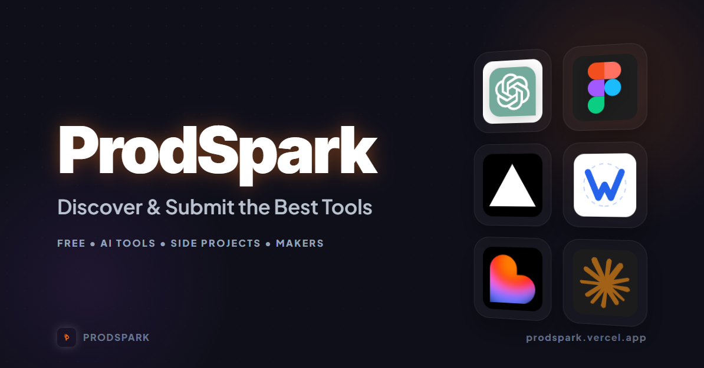

# 🚀 ProdSpark - Elite Tools Discovery Platform

<div align="center">



**Spark Your Innovation — The ultimate directory for hand-picked AI tools, dev resources, and elite digital products.**

[](https://prodspark.vercel.app)
[](https://vitejs.dev)
[](https://reactjs.org)
[](https://supabase.io)

[Live Experience](https://prodspark.vercel.app) · [Submit Intel](https://prodspark.vercel.app/submit) · [Request Feature](https://github.com/Faizyab7-bot/prodspark/issues)

</div>

---

## 📋 Table of Contents

- [Mission](#mission-statement)
- [Design Philosophy](#design-philosophy)
- [Features](#enterprise-features)
- [Ecosystem](#integrated-ecosystem)
- [Getting Started](#getting-started)
- [SEO & Architecture](#seo--visibility-architecture)
- [Deployment](#efficient-setup)
- [Legal](#license--legal)

---

## 🎯 Mission Statement

**ProdSpark** is a high-performance, community-driven discovery platform designed for the next generation of builders. We bridge the gap between innovation and discovery by providing a centralized hub for elite digital products.

### 💎 The ProdSpark Advantage

- 🔍 **Curated Intelligence** - Only the most innovative tools make it to our catalog.
- ⭐ **Deep Insights** - Community ratings and "Intel" reports provide transparent feedback.
- 🎨 **Premium UX** - A dark-themed, motion-rich interface designed for maximum productivity.
- ⚡ **Optimized Core** - Built on a lightning-fast Vite + React foundation with zero bloat.
- 🔐 **Secure-First Architecture** - Integrated with Clerk for robust identity management.

---

## 🎨 Design Philosophy

ProdSpark follows a "Modern Elite" aesthetic:
- **Clean Grid Interaction**: Use of perspectives and borders to create depth.
- **Glassmorphism**: Subtle blurs and semi-transparent layers for a premium feel.
- **Micro-interactions**: Framer Motion-driven transitions to keep the UX alive.
- **Dark Elegance**: A carefully curated dark color palette optimized for high contrast and focus.

---

## ✨ Enterprise Features

### User Experience
- 📱 **Omnichannel Responsive** - Fully optimized for mobile, tablet, and desktop viewports.
- 🌓 **Adaptive Themes** - Native dark and light mode support using standard CSS variables.
- 🔍 **Real-time Filtering** - Instant product filtering via category and pricing models.
- ⭐ **Quality Scoring** - Proprietary algorithm blending reviews, likes, and engagement metrics.
- 💬 **Community Intel** - Threaded review system with verified user credentials.

### Engineering & SEO
- ✅ **Metadata Architecture** - Dynamic Helmet integration for perfect social previews.
- ✅ **Semantic Graphs** - Full Schema.org (JSON-LD) implementation for Rich Search Results.
- ✅ **CDN-First Media** - Automated image handling via Cloudinary for sub-second loads.
- ✅ **Dynamic Sitemaps** - Automated generation of `sitemap.xml` for zero-touch SEO.
- ✅ **Authenticated Submission** - Robust form handling with server-side validation.

---

## 🛠️ Integrated Ecosystem

### Advanced Frontend
- **React 18 Architecture** - Component-driven UI development with optimized state management.
- **Vite Ecosystem** - Next-generation frontend tooling for ultra-fast HMR and optimized production bundles.
- **Tailwind CSS v4** - Precision-engineered styling using modern utility-first principles.
- **Framer Motion Engine** - Production-grade fluid animations and gesture support.
- **Lucide Icons** - A consistent, pixel-perfect icon set designed for clarity.

### Backend & Infrastructure
- **Supabase Cloud** - Postgres-backed real-time database with built-in Row Level Security (RLS).
- **Clerk Identity** - Enterprise-grade user authentication and profile management.
- **Cloudinary Media** - Intelligent image transformations, global delivery, and optimized storage.

---

## 🚀 Getting Started

### Prerequisites
- Node.js 18+ & npm
- Accounts: Clerk, Supabase, Cloudinary

### Local Installation
1. **Clone & Enter**:
   ```bash
   git clone https://github.com/Faizyab7-bot/prodspark.git
   cd prodspark
   ```
2. **Install Dependencies**:
   ```bash
   npm install --legacy-peer-deps
   ```
3. **Environment Sync**:
   ```bash
   cp .env.example .env
   # Update .env with your specific API keys
   ```
4. **Launch Dev Hub**:
   ```bash
   npm run dev
   ```

### 🔐 Environment Configuration
| Variable | Usage |
| :--- | :--- |
| `VITE_CLERK_PUBLISHABLE_KEY` | Identity Gateway |
| `VITE_SUPABASE_URL` | Database Endpoint |
| `VITE_SUPABASE_ANON_KEY` | Public API Access |
| `VITE_CLOUDINARY_CLOUD_NAME` | Media Storage |

---

## 🔍 SEO & Visibility Architecture

ProdSpark is engineered for search dominance:
- ✅ **Dynamic Meta Injection**: Per-page title/description optimization via `SEO.tsx`.
- ✅ **Social Graphing**: Complete OG & Twitter card support for viral sharing.
- ✅ **Structured Data**: JSON-LD implemention for Organization and Product schemas.
- ✅ **Crawler Optimization**: Automated `sitemap.xml` and validated `robots.txt`.

---

## 🚀 Efficient Setup

### Deployment Blueprint (Vercel)

1. **Provision Environment**: Ensure all keys from [.env.example](.env.example) are added to Vercel Secrets.
2. **Execute Build**: `npm run build`
3. **Continuous Deployment**: Push to `main` for automated production deployment.

---

## 📄 License & Legal

This project is distributed under the **MIT License**. Empowering developers to build, iterate, and innovate freely.

---

<div align="center">

**Crafted with Precision by [Faizyab Hussain](https://github.com/FaizyabHussain07)**

---

[Website](https://prodspark.vercel.app) • [GitHub](https://github.com/Faizyab7-bot) • [Contact Support](mailto:support@prodspark.com)

**© 2026 ProdSpark Elite. All rights reserved.**

</div>
